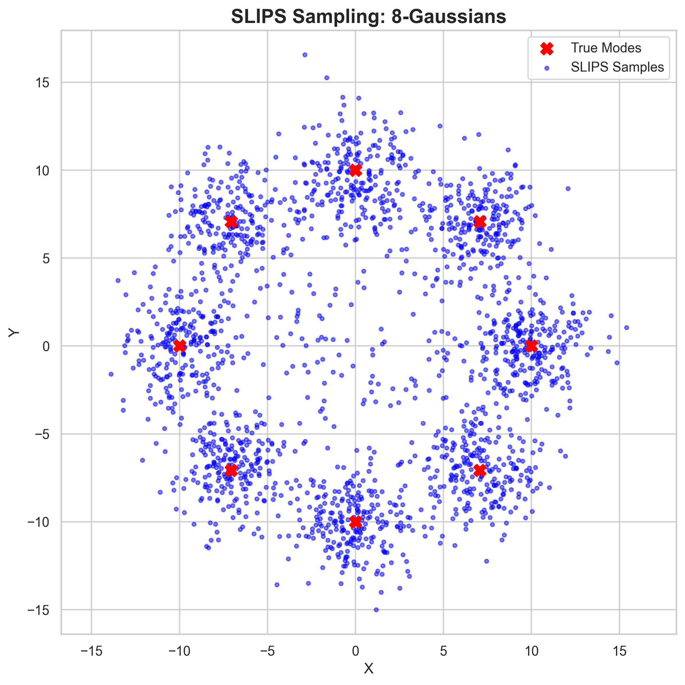

# Disclaimer:
This library contains a fraction of my work done during my 2026 internship at **Imperial College London**.

The ideas we are currently developping are not presented here. You will find here implementations of some other papers used to benchmark and compare our own algorithms against.

# 🚀 ErgodiX

[](https://www.python.org/downloads/release/python-3110/)
[](https://github.com/google/jax)
[](https://opensource.org/licenses/MIT)

**ErgodiX** is a high-performance, hardware-accelerated Python library designed to benchmark state-of-the-art MCMC and diffusion-based sampling algorithms. 

This repository currently features a highly optimized, fully JIT-compiled implementation of **Stochastic Localization via Iterative Posterior Sampling (SLIPS)**, based on the [2024 paper by Grenioux et al](https://arxiv.org/abs/2402.10758). 

It is built heavily on `JAX` and `Equinox` to ensure that both the target distributions and the sampling loops can be vectorized and executed flawlessly on GPUs/TPUs.

---

## 📸 Visuals

Below is an example of the SLIPS algorithm successfully capturing the highly multimodal **8-Gaussians** distribution. Standard local MCMC methods (like MALA or HMC) frequently collapse into a single mode in this scenario.



---

## 🚀 Key Features

* **Hardware Accelerated**: Fully written in JAX. Computations are JIT-compiled (`jax.jit`) and mapped over batches (`jax.vmap`), allowing you to run thousands of chains in parallel.
* **Modular Schedules**: Implement arbitrary noising schedules easily by subclassing the `Schedule` Equinox module.
* **Robust Distribution Library**: Includes challenging benchmark distributions like Funnel, Banana, Rings, Rosenbrock, and high-dimensional Bayesian Logistic Regression (on UCI Sonar and Ionosphere datasets).
* **Strong Typing**: Uses `jaxtyping` extensively for clear, reliable array shapes and types.

---

## 📦 Installation

To install the package locally, clone the repository and install it via `pip`. Using a virtual environment is highly recommended.

```bash
git clone [https://github.com/ArthurGilles/ErgodiX.git](https://github.com/ArthurGilles/ErgodiX.git)
cd ErgodiX

# Install core dependencies
pip install -e .

# Install development/testing dependencies
pip install -e ".[dev]"
```


# 💻 Quickstart: Sampling with SLIPS

The SLIPS algorithm relies on a predefined noise schedule and relies on MALA (Metropolis-Adjusted Langevin Algorithm) inner loops to estimate the denoiser. Here is how to sample from a custom distribution in just a few lines of code:

```python
import jax
import jax.numpy as jnp
from ergodix.slips import slips, SLIPSParams, GeomSchedule
from ergodix.distributions import IsotropicGaussian

# 1. Set up the random key and target distribution
key = jax.random.PRNGKey(42)
dim = 2
target_dist = IsotropicGaussian(mean=jnp.zeros(dim), std=jnp.ones(dim))

# 2. Configure the scheduling and time grid
schedule = GeomSchedule(alpha_1=1.0, alpha_2=1.0)
time_grid = schedule.get_snr_grid(t_0=0.1, t_end=0.98, steps=20)

# 3. Bundle hyperparameters
params = SLIPSParams(
    sigma=10.0, 
    schedule=schedule,
    n_mcmc_steps=64,
    n_chains=8,
    n_init_steps=64,
    return_history=False
)

# 4. Execute parallel sampling
batch_size = 1000
samples = slips(key, target_dist, time_grid, batch_size, dim, params)

print(f"Generated {samples.shape[0]} samples of dimension {samples.shape[1]}")
```


# 🗂️ Project Architecture

The codebase is organized into two primary subpackages:


1. `nano_sampler_jax.distribution`

An object-oriented collection of target distributions inheriting from TargetDistribution (an equinox.Module).

- Toy 2D Geometries: `Banana`, `Rings`, `Rosenbrock`

- High-Dimensional Benchmarks: `Funnel` (Neal, 2003), `IsotropicGaussian`

- Mixture Models: `IsotropicGMM`, `FullCovGMM`

- Real-world Posteriors: `BayesianLogisticRegression` (with utility loaders for UCI datasets)

You can define your own distributions by making them inherit from the `TargetDistribution` class and overiding the `__call__` method:

```python
from jaxtyping import Array, Float
from ergodix.distributions import TargetDistribution

class MyDistribution(TargetDistribution):
    param_1: float = 0.0
    param_2: float = 1.0
    
    def __call__(self, x: Float[Array, "2"]) -> Float[Array, ""]:        
        return ...
```

2. `nano_sampler_jax.slips`

The core implementation of the SLIPS algorithm.

- `slips.py`: Contains the _single_slips logic and the vectorized, JIT-compiled slips wrapper. Utilizes jax.lax.scan and jax.lax.fori_loop for strict compilation.

- `mala.py`: The Metropolis-Adjusted Langevin step logic used to estimate the SLIPS denoiser.

- `schedules.py`: Contains `StandardSchedule` and `GeomSchedule ` definitions to construct the Signal-to-Noise Ratio (SNR) grids.

- `params.py`: The `SLIPSParams` dataclass for organizing sampler hyperparameters (step sizes, burn-in ratios, chain counts).

# 🧪 Running Tests

The repository is fully unit-tested using pytest. The test suite validates gradients, shapes, edge-cases for schedules, and end-to-end execution of the SLIPS algorithm.

```bash
pytest tests/ -v
```